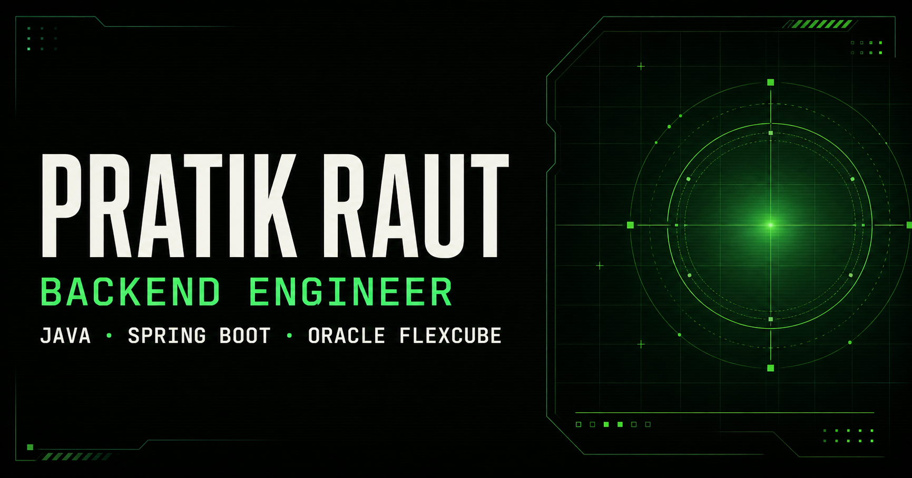

# Pratik Raut — Backend Engineer Portfolio

[](https://github.com/pratikmraut/pratik-raut-portfolio/actions/workflows/ci.yml)

An interactive, production-terminal-inspired portfolio for Java backend engineer Pratik Raut.



## Features

- Recruiter-friendly résumé content with quantified engineering impact
- Interactive command terminal with `help`, `projects`, `skills`, `status`, and more
- Responsive hacker-style identity console for desktop, tablet, and mobile
- Live `/api/status` server endpoint
- Accessible keyboard focus, semantic landmarks, and reduced-motion support
- Search and social metadata, custom favicon, social preview, and downloadable résumé
- Cloudflare-compatible Worker output with defensive response headers

## Tech stack

- React 19 and TypeScript
- Next.js App Router APIs through Vinext
- Vite and Cloudflare Workers tooling
- Plain CSS with a custom black-and-green design system
- Node.js built-in test runner and ESLint

## Run locally

Requirements: Node.js 22.13 or newer.

```powershell
npm.cmd install
npm.cmd run dev
```

Open `http://localhost:3000`.

## Quality checks

```powershell
npm.cmd run lint
npm.cmd run typecheck
npm.cmd test
npm.cmd audit
```

The test command creates the production build and validates both the rendered portfolio and the live status endpoint.

## Project structure

- `app/page.tsx` — portfolio sections and identity console
- `app/components/Terminal.tsx` — interactive terminal
- `app/portfolio-data.ts` — résumé-backed content and public links
- `app/api/status/route.ts` — server status API
- `app/globals.css` — visual system and responsive layout
- `worker/index.ts` — production Worker entry and security headers
- `tests/rendered-html.test.mjs` — server-render and API checks

## Deployment

`npm.cmd run build` produces a Cloudflare-compatible deployment in `dist/`. Because the portfolio includes server-rendered metadata and `/api/status`, GitHub Pages is not the intended runtime; deploy it to a Workers- or Node-compatible host.

## License

The software is available under the [MIT License](LICENSE). The résumé, portrait, biography, employment history, and other personal content remain © Pratik Raut and are not licensed for reuse.
